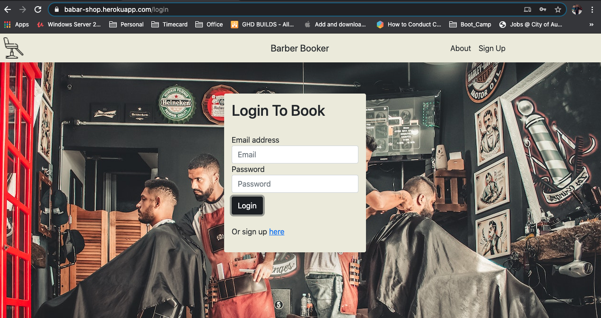
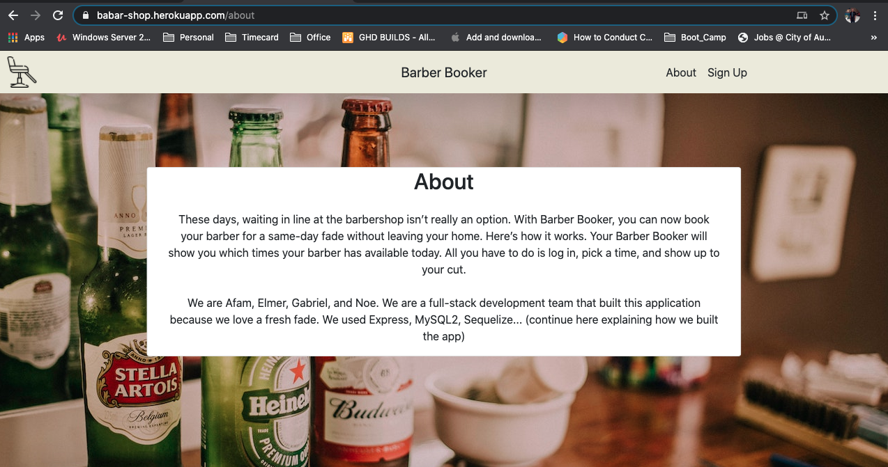
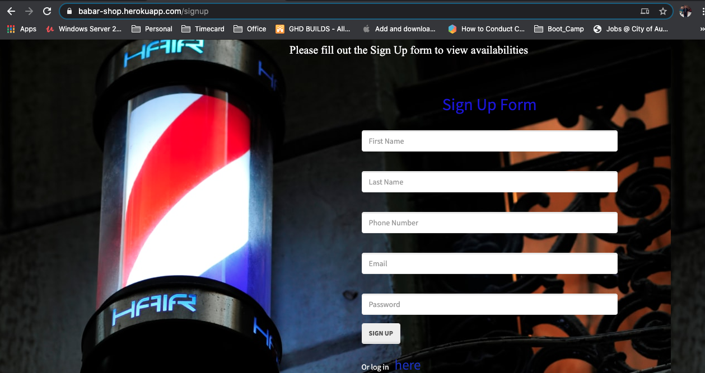

# Barbar Booker

# Table of Contents  

* [Discription](#discription)
* [Screenshot](#screenshot)   
* [Contacts](#contacts)
* [Programming-Language](#programming-language)

## Discription   

These days, waiting in line at the barbershop isn’t really an option.
With Barber Booker, you can now book your barber for a same-day fade without leaving your home. Here’s how it works. Your Barber Booker will show you which times your barber has available today. All you have to do is log in, pick a time, and show up to your cut.

## Screenshot

 
## Contacts Info

Team members Github usernames 

\`\`\`

    Afam-26

    GabrielG_Neo

    noerios 

    Elmer196
\`\`\`

## Tools used
\`\`\`

    Node Js

    MySQL 

    Sequelize

    Heroku
\`\`\`

# Links

[Github link](https://github.com/Afam-26/Barber-Scheduler.git) 

[Heroku-Deployed-Application](https://babar-shop.herokuapp.com/)

# Project-TEAM

**Noe Rios -> Frontend**

**Gabriel Gonzales -> Frontend**

**Elmer Hernandez -> Backend**

**Afamefuna Anekeh -> Backend**